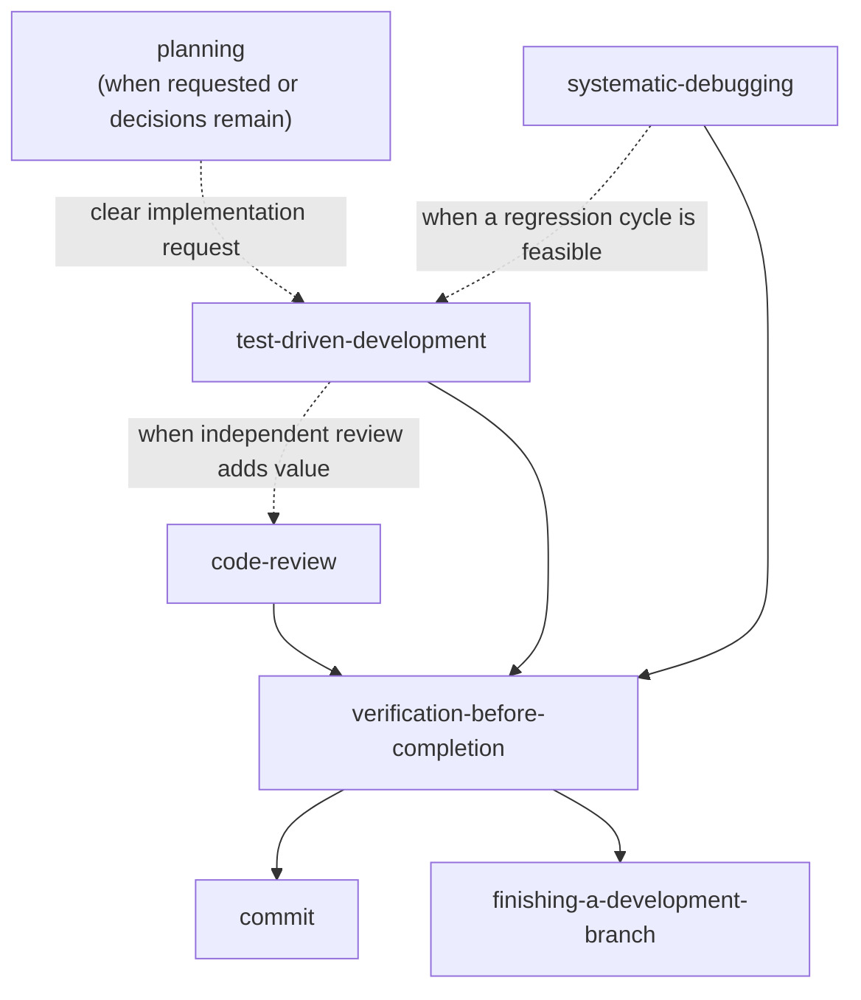

# pi-skills

A personal skills library for [pi](https://github.com/badlogic/pi-mono/tree/main/packages/coding-agent). The skills use pi tool names and pi workflows only.

## Installation

Clone into a subdirectory of pi's global skills location:

```bash
git clone https://github.com/fgladisch/pi-skills.git ~/.agents/skills/pi-skills
```

Or use pi's dedicated location (also as a subdirectory):

```bash
git clone https://github.com/fgladisch/pi-skills.git ~/.pi/agent/skills/pi-skills
```

For local development, you can symlink the `skills/` directory into pi's global skills path:

```bash
mkdir -p ~/.pi/agent/skills
ln -s ~/code/pi-skills/skills ~/.pi/agent/skills/pi-skills
```

## Skills

| Skill                            | When to use                                                                                                                                                                                     |
| -------------------------------- | ----------------------------------------------------------------------------------------------------------------------------------------------------------------------------------------------- |
| `code-review`                    | When reviewing a change, evaluating review feedback, or cleaning up a scoped diff before completion or integration                                                                              |
| `commit`                         | When the user asks to commit changes; follows repository conventions with gitmoji as the fallback (uses [`@fgladisch/pi-user-select`](https://www.npmjs.com/package/@fgladisch/pi-user-select)) |
| `finishing-a-development-branch` | When completed branch work is ready to merge, publish as a PR, retain, or discard (uses [`@fgladisch/pi-user-select`](https://www.npmjs.com/package/@fgladisch/pi-user-select))                 |
| `planning`                       | When the user asks for a design or plan, or a change has consequential unresolved decisions                                                                                                     |
| `systematic-debugging`           | When a bug, failing test, build failure, performance regression, or unexpected behavior needs diagnosis                                                                                         |
| `test-driven-development`        | For behavior changes and bug fixes when a test or executable regression check can establish the expected result first                                                                           |
| `verification-before-completion` | Before claiming work is complete, fixed, passing, reviewed, ready, committed, or integrated                                                                                                     |

## Skill dependency graph



Dashed edges are optional. Clear implementation requests can proceed without a planning ceremony, and review depth should match the size and risk of the change.

## Required extensions

Some skills depend on extension-provided tools. Install these before using the related skills:

| Extension                                                                              | Tool(s) provided | Required by skills                         |
| -------------------------------------------------------------------------------------- | ---------------- | ------------------------------------------ |
| [`@fgladisch/pi-user-select`](https://www.npmjs.com/package/@fgladisch/pi-user-select) | `user_select`    | `commit`, `finishing-a-development-branch` |

## Pi-specific notes

- Project context lives in `AGENTS.md`, pi's preferred project-instructions file.
- [`pi-subagents`](https://github.com/nicobailon/pi-subagents) is an optional companion for delegated work and provides its own orchestration guidance.
- Skills use pi tools directly: `read`, `write`, `edit`, `bash`, and extension tools when installed.

## License

MIT — see [LICENSE](LICENSE).
