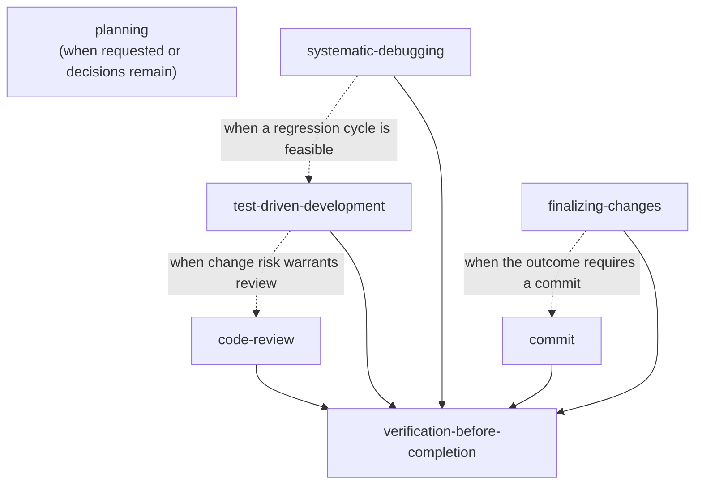

# omp-skills

A personal skills and command library for [Oh My Pi](https://github.com/can1357/oh-my-pi). The content targets OMP's built-in tool surface and execution workflows.

## Installation

OMP discovers user skills one directory below `~/.omp/agent/skills/` and command files in `~/.omp/agent/commands/`. Clone the repository, then symlink each entry:

```sh
git clone https://github.com/fgladisch/omp-skills.git ~/.omp/omp-skills
mkdir -p ~/.omp/agent/skills ~/.omp/agent/commands
for skill in "$HOME"/.omp/omp-skills/skills/*; do
  ln -sfn "$skill" "$HOME/.omp/agent/skills/$(basename "$skill")"
done
for command in "$HOME"/.omp/omp-skills/commands/*.md; do
  ln -sfn "$command" "$HOME/.omp/agent/commands/$(basename "$command")"
done
```

For local development, replace `"$HOME"/.omp/omp-skills` with the path to this checkout. Restart OMP after adding or removing skills or commands so discovery runs again.

## Commands

| Command              | Purpose                                         |
| -------------------- | ----------------------------------------------- |
| `local-review-cycle` | Review local changes and apply fixes until LGTM |

## Skills

| Skill                            | When to use                                                                                                           |
| -------------------------------- | --------------------------------------------------------------------------------------------------------------------- |
| `code-review`                    | When reviewing code                                                                                                   |
| `commit`                         | When the user asks to commit changes; follows repository conventions with gitmoji as the fallback                     |
| `finalizing-changes`             | When a coherent set of changes is ready to validate and then commit, merge, publish as a PR, or retain                |
| `planning`                       | While plan mode is active to shape plan contents; also for plan-only requests or consequential unresolved decisions   |
| `systematic-debugging`           | When a bug, failing test, build failure, performance regression, or unexpected behavior needs diagnosis               |
| `test-driven-development`        | For behavior changes and bug fixes when a test or executable regression check can establish the expected result first |
| `verification-before-completion` | Before claiming work is complete, fixed, passing, reviewed, ready, committed, or integrated                           |

## Skill dependency graph



Arrows mean the source skill explicitly applies the target skill, and dashed edges are conditional. Planning is an independent entry point; clear implementation requests can proceed without it. TDD requests independent review only when compatibility, security, data-integrity, or operational risk warrants the additional pass.

## OMP tooling

- `ask` provides structured decisions; no extension-provided selection tool is required.
- `read`, `glob`, `grep`, `lsp`, `edit`, and `write` handle repository inspection and changes before shell fallbacks.
- `debug` and `browser` verify runtime and UI behavior directly.
- `task`, `hub`, and `todo` provide parallel agents, process supervision, and phase tracking.
- Skills and their supporting files are addressable through `skill://<name>`.
- Project instructions live in `AGENTS.md`; OMP loads them as repository context.

## License

MIT — see [LICENSE](LICENSE).
