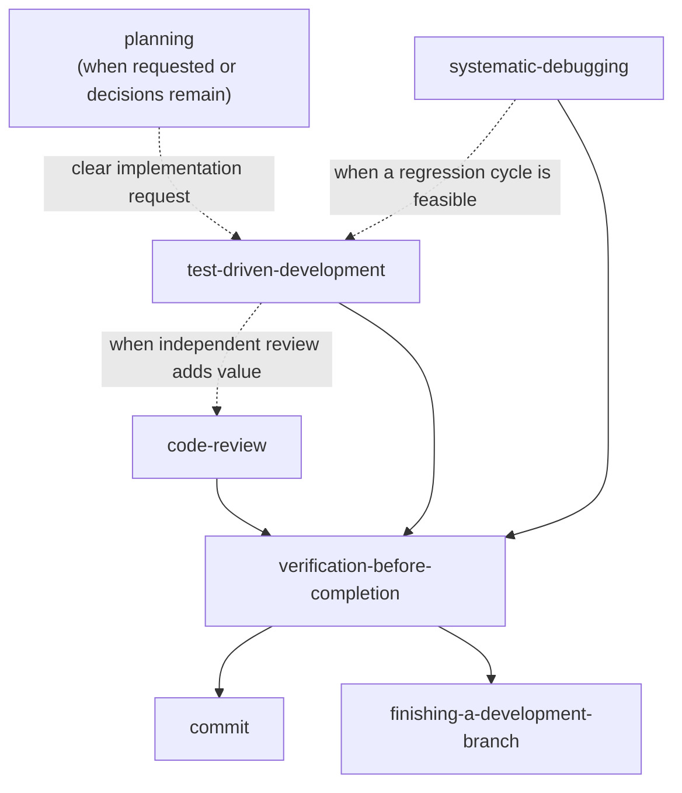

# GPT-5.6 Skill Consolidation Implementation Plan

> **For agentic workers:** Execute tasks in order. Keep one writer in the active worktree. Do not commit, push, or open a pull request unless the user authorizes that action.

**Goal:** Replace twelve overlapping, prescriptive skills with seven lean skills aligned with OpenAI's GPT-5.6 prompting guidance.

**Architecture:** Consolidate related triggers into `planning` and `code-review`, keep focused workflows for debugging, testing, verification, commits, and branch completion, and rely on the installed `pi-subagents` skill for delegation mechanics. Each skill states an outcome, proportional workflow, approval boundaries, and evidence requirements once.

**Tech Stack:** Markdown, YAML frontmatter, Git, Prettier

---

### Task 1: Consolidate planning skills

**Files:**

- Create: `skills/planning/SKILL.md`
- Delete: `skills/brainstorming/`
- Delete: `skills/writing-plans/`

- [ ] **Step 1: Create the consolidated planning skill**

Create `skills/planning/SKILL.md` with this content:

```markdown
---
name: planning
description: Use when the user asks for a design or implementation plan, or when a requested change has consequential unresolved decisions that should be settled before editing.
---

# Planning

Produce only the design or implementation detail needed to make the next action reliable.

## Decide whether planning is needed

- If the user asks only for analysis, design, or a plan, inspect the relevant material and return that artifact. Do not implement.
- If the user asks for implementation and the requirements are clear, proceed without a mandatory planning ceremony.
- Pause when an unresolved choice could materially change behavior, compatibility, data handling, security, or scope. Ask the smallest necessary set of independent questions together and recommend answers. Ask sequentially only when one answer determines the next question.
- Resolve questions from the repository, documentation, or existing conventions before asking the user.

## Build the plan

1. Inspect project instructions, relevant code, tests, documentation, and recent changes.
2. State the goal, constraints, success criteria, and non-goals.
3. Record consequential decisions and the reason for the chosen approach. Compare alternatives only when the choice is real.
4. Identify affected components, interfaces, data flow, failure handling, and validation.
5. Break implementation into ordered units with exact paths when the work needs a durable handoff.

Scale the artifact to the task. A small change may need a short inline plan. A broad or risky change may need a written design and task plan. Do not create documents or commits unless requested or required by project instructions.

## Approval boundaries

Safe local inspection and planning do not need confirmation. Ask before:

- choosing between materially different product behaviors when context cannot decide;
- expanding scope beyond the request;
- writing externally, spending money, or performing destructive actions.

When the user requested implementation, design approval is optional unless a consequential ambiguity remains.

## Output

Lead with the recommended approach. Include affected areas, validation, and any unresolved risk. Omit repeated rationale, generic best practices, and implementation detail that the next worker can infer safely from the repository.
```

- [ ] **Step 2: Remove the replaced directories**

Run:

```bash
rm -rf skills/brainstorming skills/writing-plans
```

- [ ] **Step 3: Validate the new skill**

Run:

```bash
npx prettier --check skills/planning/SKILL.md
rg -n 'brainstorming|writing-plans' skills/planning || true
```

Expected: Prettier passes and the search returns no matches.

### Task 2: Consolidate code-review skills

**Files:**

- Create: `skills/code-review/SKILL.md`
- Delete: `skills/receiving-code-review/`
- Delete: `skills/requesting-code-review/`
- Delete: `skills/simplify/`

- [ ] **Step 1: Create the consolidated code-review skill**

Create `skills/code-review/SKILL.md` with this content:

```markdown
---
name: code-review
description: Use when reviewing a change, evaluating code-review feedback, or cleaning up a scoped diff before completion or integration.
---

# Code Review

Find material defects in a defined change, evaluate findings against repository evidence, and fix accepted issues when the request authorizes edits.

## Establish scope

Determine:

- the diff, files, commit range, or feedback items under review;
- the intended behavior and relevant project conventions;
- whether the request authorizes review only or also authorizes local fixes.

Inspect the code and tests instead of relying on summaries. If the scope is unclear and cannot be inferred, ask before reviewing the wrong change.

## Review

Prioritize findings that affect correctness, security, data integrity, compatibility, or maintainability. Check for missing requirements and tests, regressions, duplicated existing behavior, unnecessary complexity, and avoidable performance costs.

Each finding must include:

- severity;
- exact file and location;
- the concrete failure or risk;
- supporting evidence;
- a specific correction.

Return findings in severity order. Do not inflate stylistic preferences into defects. If no material findings exist, say so and name any validation gap.

## Use subagents selectively

Review directly by default. Use one fresh, read-only subagent when independent judgment or task shape materially improves confidence. Use parallel reviewers only when a broad or high-risk diff has distinct review angles that justify the extra cost. Give every subagent the same explicit scope and ask for findings only. The parent validates and synthesizes their reports.

## Evaluate incoming feedback

For each review comment:

1. Restate the technical claim when clarification is useful.
2. Verify it against the current code, requirements, and supported environments.
3. Accept, reject, or ask about the finding with evidence.
4. Check whether the proposed change expands scope or adds unused behavior.

Implement accepted findings when edits are authorized. Push back directly on incorrect or out-of-scope advice. Avoid performative agreement.

## Fix and validate

Keep fixes scoped to accepted findings. Run focused checks for the changed behavior, then broader validation proportional to regression risk. Apply `verification-before-completion` before claiming the review or fixes are complete.
```

- [ ] **Step 2: Remove the replaced directories**

Run:

```bash
rm -rf skills/receiving-code-review skills/requesting-code-review skills/simplify
```

- [ ] **Step 3: Validate the new skill**

Run:

```bash
npx prettier --check skills/code-review/SKILL.md
rg -n 'receiving-code-review|requesting-code-review|simplify' skills/code-review || true
```

Expected: Prettier passes and the search returns no matches.

### Task 3: Remove redundant delegation workflows

**Files:**

- Delete: `skills/dispatching-parallel-agents/`
- Delete: `skills/subagent-driven-development/`

- [ ] **Step 1: Remove both directories**

Run:

```bash
rm -rf skills/dispatching-parallel-agents skills/subagent-driven-development
```

- [ ] **Step 2: Confirm removal**

Run:

```bash
test ! -e skills/dispatching-parallel-agents
test ! -e skills/subagent-driven-development
```

Expected: both commands exit successfully.

### Task 4: Rewrite debugging and test-first guidance

**Files:**

- Rewrite: `skills/systematic-debugging/SKILL.md`
- Delete: `skills/systematic-debugging/condition-based-waiting.md`
- Delete: `skills/systematic-debugging/defense-in-depth.md`
- Delete: `skills/systematic-debugging/root-cause-tracing.md`
- Rewrite: `skills/test-driven-development/SKILL.md`
- Delete: `skills/test-driven-development/testing-anti-patterns.md`

- [ ] **Step 1: Rewrite systematic debugging**

Replace `skills/systematic-debugging/SKILL.md` with:

```markdown
---
name: systematic-debugging
description: Use when a bug, failing test, build failure, performance regression, or other unexpected behavior needs diagnosis before a fix is proposed.
---

# Systematic Debugging

Find evidence for the failure mechanism before changing production behavior.

## Diagnose

1. Read the complete error, logs, and stack trace.
2. Reproduce the symptom with the smallest reliable command or sequence. If it is intermittent, record the observed conditions instead of guessing.
3. Inspect recent changes, environment differences, configuration, and nearby working examples.
4. Trace incorrect data or state backward to its source. At component boundaries, capture inputs and outputs while avoiding secrets.
5. State one falsifiable hypothesis: the suspected cause, the evidence supporting it, and the result that would disprove it.
6. Run the smallest experiment that distinguishes this hypothesis from alternatives.

Do not mix speculative fixes into evidence gathering. When an experiment disproves the hypothesis, update it from the new evidence.

## Fix

Once the cause is supported:

1. Add a focused regression test or executable reproduction when feasible.
2. Change the source of the fault with the smallest sufficient patch.
3. Verify the original symptom, the focused regression check, and broader checks proportional to the affected area.
4. Remove temporary diagnostics unless they provide lasting operational value.

Use `test-driven-development` when an automated failing check or executable regression cycle is feasible. Apply `verification-before-completion` before reporting the bug fixed.

## Escalate

Stop and report the evidence gap when reproduction requires unavailable access, data, hardware, or credentials. Reconsider the design when repeated well-supported hypotheses fail or each attempted fix exposes a different coupling problem. Ask before broad architectural work or scope expansion.

Report the root cause, evidence, change, verification, and any remaining uncertainty.
```

- [ ] **Step 2: Remove debugging reference files**

Run:

```bash
rm skills/systematic-debugging/condition-based-waiting.md \
  skills/systematic-debugging/defense-in-depth.md \
  skills/systematic-debugging/root-cause-tracing.md
```

- [ ] **Step 3: Rewrite test-driven development**

Replace `skills/test-driven-development/SKILL.md` with:

```markdown
---
name: test-driven-development
description: Use for behavior changes and bug fixes when an automated test or executable regression check can establish the expected result before production code changes.
---

# Test-Driven Development

Use a failing check to define observable behavior, then make the smallest change that satisfies it.

## Red, green, refactor

1. Choose one externally meaningful behavior or regression.
2. Write the smallest test that expresses the expected result using public behavior where practical.
3. Run it and confirm it fails for the intended reason. A syntax error or unrelated failure does not establish the red state.
4. Implement the smallest sufficient production change.
5. Run the focused test until it passes, then run broader checks proportional to regression risk.
6. Refactor only while the tests remain green.

Tests should be deterministic, readable, and resistant to implementation-only changes. Prefer real collaborators when cheap and reliable; use fakes or mocks at slow, unstable, destructive, or external boundaries. Avoid production APIs that exist only to support tests.

## When strict test-first is impractical

A test-first cycle may add little value for documentation, generated artifacts, configuration-only edits, exploratory spikes, or environments without a usable automated harness. Proceed without asking when the exception is clear, and record the alternative validation used. For legacy code that is hard to isolate, add the narrowest characterization or integration check that can expose the regression.

Do not delete correct pre-existing work merely because its tests were written later. Improve its evidence from the current state.

Apply `verification-before-completion` before claiming the behavior works or the regression is covered.
```

- [ ] **Step 4: Remove the testing reference file and validate**

Run:

```bash
rm skills/test-driven-development/testing-anti-patterns.md
npx prettier --check skills/systematic-debugging/SKILL.md skills/test-driven-development/SKILL.md
```

Expected: Prettier passes.

### Task 5: Rewrite completion verification

**Files:**

- Rewrite: `skills/verification-before-completion/SKILL.md`

- [ ] **Step 1: Replace the skill content**

Replace `skills/verification-before-completion/SKILL.md` with:

```markdown
---
name: verification-before-completion
description: Use before claiming work is complete, fixed, passing, reviewed, ready, committed, or integrated; match each material claim to fresh evidence.
---

# Verification Before Completion

Report the state proven by current evidence. Do not turn expectations or delegated reports into success claims.

## Verification gate

Before a material completion or correctness claim:

1. Identify the evidence that would prove it.
2. Run the relevant command or inspect the authoritative artifact after the final change.
3. Check the exit status and read enough output to detect failures, skipped coverage, or partial execution.
4. Compare the result with the request and repository conventions.
5. State the result with the evidence. If validation failed or could not run, report that limitation directly.

Choose checks proportional to the change and risk. A focused documentation edit may need formatting, link, and diff checks. Runtime behavior may need focused tests plus a broader suite, build, typecheck, or lint command. Do not run unrelated expensive suites solely to satisfy a ritual.

## Delegated work

Treat subagent reports as leads. Inspect the resulting diff or artifact and independently run the checks needed for the final claim.

## Reporting

Lead with the result. Include the commands or artifacts that support it, material caveats, and the next action when work remains. Avoid “should pass,” “looks correct,” or equivalent wording when the evidence is absent.
```

- [ ] **Step 2: Validate formatting**

Run:

```bash
npx prettier --check skills/verification-before-completion/SKILL.md
```

Expected: Prettier passes.

### Task 6: Rewrite consequential Git workflows

**Files:**

- Rewrite: `skills/commit/SKILL.md`
- Rewrite: `skills/finishing-a-development-branch/SKILL.md`

- [ ] **Step 1: Rewrite commit**

Replace `skills/commit/SKILL.md` with:

```markdown
---
name: commit
description: Use when the user asks to commit, create a commit, stage and commit, or run git commit; follows repository conventions with gitmoji as the fallback.
---

# Commit

Create one intentional commit from an explicitly confirmed file set and message.

## Prepare

1. Read project commit instructions and recent commit subjects.
2. Inspect `git status --short`, `git diff`, and `git diff --cached`.
3. Stop if there are no changes. Separate unrelated concerns rather than hiding them in one commit.
4. Run validation proportional to the selected changes unless the user explicitly requested a no-verify workflow.

Follow the repository's commit format. If none exists, use `<gitmoji> <type>: <description>` with a concise subject:

| Change                 | Fallback       |
| ---------------------- | -------------- |
| Feature                | `✨ feat:`     |
| Fix                    | `🐛 fix:`      |
| Refactor               | `♻️ refactor:` |
| Tests                  | `✅ test:`     |
| Documentation          | `📝 docs:`     |
| Removal                | `🔥 remove:`   |
| Tooling or maintenance | `🔧 chore:`    |

## Confirm

Use `user_select` once to show the proposed message, exact file list, and validation result. Offer: commit as-is, edit message, edit files, or cancel. Reconfirm after edits.

## Commit

Stage specific paths. Do not use `git add .` or `git add -A` unless the user explicitly selected the whole working tree. Create the commit without interactive flags, then inspect `git status --short` and the new commit.

If a hook fails, report the failure and keep the commit uncreated. Fix hook failures only when authorized by the original request or a follow-up. Never bypass hooks, amend, push, add attribution, or broaden the file set without explicit authorization.
```

- [ ] **Step 2: Rewrite branch completion**

Replace `skills/finishing-a-development-branch/SKILL.md` with:

```markdown
---
name: finishing-a-development-branch
description: Use when completed branch work is ready to merge locally, publish as a pull request, retain, or discard.
---

# Finishing a Development Branch

Validate the branch, present the feasible outcomes, and perform only the selected integration or cleanup action.

## Establish state

1. Inspect the current branch, worktree, status, remotes, and repository instructions.
2. Resolve the intended base branch from explicit context or the remote default. Ask if it remains ambiguous.
3. Stop on detached HEAD, unexpected uncommitted changes, or when the feature and base branch are the same. Report the recovery needed instead of guessing.
4. Run fresh validation proportional to the branch changes. If it fails, report the failures and do not present the branch as ready.

## Present outcomes

Use `user_select` for the actions that are actually available:

- merge into the base branch locally, preserving the feature branch unless deletion is explicitly included;
- push and create a pull request;
- keep the branch and worktree unchanged;
- discard the branch work.

The selection authorizes the named merge, push/PR, or keep action. Discard remains destructive and requires a second confirmation showing the branch, commits, uncommitted files, and worktree that will be removed.

## Execute

### Merge locally

Update the base branch only when doing so is safe under repository policy, merge without force, and run relevant validation on the merged result. Preserve the feature branch unless the selected outcome explicitly included deletion or the user confirms it separately.

### Push and create a pull request

Show the intended remote, branch, PR title, and summary before the selection. After authorization, push without force and create the PR. Report its URL and preserve the feature branch/worktree unless the user asks for cleanup.

### Keep

Leave the branch and worktree unchanged and report their names and paths.

### Discard

After explicit destructive confirmation, remove the worktree safely and delete only the named feature branch. Never delete the base branch or unrelated uncommitted work.

Apply `verification-before-completion` to claims about tests, merges, pushes, PR creation, or cleanup.
```

- [ ] **Step 3: Validate both skills**

Run:

```bash
npx prettier --check skills/commit/SKILL.md skills/finishing-a-development-branch/SKILL.md
```

Expected: Prettier passes.

### Task 7: Synchronize README and validate the repository

**Files:**

- Modify: `README.md`

- [ ] **Step 1: Replace the Skills table**

Use these rows in alphabetical order:

```markdown
| Skill                            | When to use                                                                                                                                                                                     |
| -------------------------------- | ----------------------------------------------------------------------------------------------------------------------------------------------------------------------------------------------- |
| `code-review`                    | When reviewing a change, evaluating review feedback, or cleaning up a scoped diff before completion or integration                                                                              |
| `commit`                         | When the user asks to commit changes; follows repository conventions with gitmoji as the fallback (uses [`@fgladisch/pi-user-select`](https://www.npmjs.com/package/@fgladisch/pi-user-select)) |
| `finishing-a-development-branch` | When completed branch work is ready to merge, publish as a PR, retain, or discard (uses [`@fgladisch/pi-user-select`](https://www.npmjs.com/package/@fgladisch/pi-user-select))                 |
| `planning`                       | When the user asks for a design or plan, or a change has consequential unresolved decisions                                                                                                     |
| `systematic-debugging`           | When a bug, failing test, build failure, performance regression, or unexpected behavior needs diagnosis                                                                                         |
| `test-driven-development`        | For behavior changes and bug fixes when a test or executable regression check can establish the expected result first                                                                           |
| `verification-before-completion` | Before claiming work is complete, fixed, passing, reviewed, ready, committed, or integrated                                                                                                     |
```

- [ ] **Step 2: Replace the dependency graph**

Use:

````markdown

````

Dashed edges are optional. Clear implementation requests can proceed without a planning ceremony, and review depth should match the size and risk of the change.

- [ ] **Step 3: Replace extension dependencies**

Keep only `@fgladisch/pi-user-select` in the required extensions table, required by `commit` and `finishing-a-development-branch`. In Pi-specific notes, describe `pi-subagents` as an optional companion for delegated work and link to its project. Remove the required `subagent` extension row and the `subagent({ action: "doctor" })` instruction.

- [ ] **Step 4: Format all changed Markdown**

Run:

```bash
npx prettier --write README.md skills/*/SKILL.md docs/pi/plans/2026-07-30-gpt-5-6-skill-consolidation.md
```

Expected: Prettier exits successfully.

- [ ] **Step 5: Verify skill-directory synchronization**

Run:

```bash
ls -1 skills | grep -v '^\.'
rg '^\| `[^`]+`' README.md
```

Expected skill directories, exactly once in both outputs:

```text
code-review
commit
finishing-a-development-branch
planning
systematic-debugging
test-driven-development
verification-before-completion
```

- [ ] **Step 6: Verify frontmatter names and deleted references**

Run:

```bash
for skill in skills/*; do
  name=$(awk '/^name: / { print $2; exit }' "$skill/SKILL.md")
  test "$name" = "$(basename "$skill")" || exit 1
done

! rg -n 'brainstorming|dispatching-parallel-agents|receiving-code-review|requesting-code-review|simplify|subagent-driven-development|writing-plans|HARD-GATE|Iron Law|NO PRODUCTION CODE|MUST use|REQUIRED SUB-SKILL' skills README.md
```

Expected: both commands exit successfully and the search prints no matches.

- [ ] **Step 7: Run final Markdown and diff validation**

Run:

```bash
npx prettier --check README.md skills/*/SKILL.md docs/pi/specs/2026-07-30-gpt-5-6-skill-consolidation-design.md docs/pi/plans/2026-07-30-gpt-5-6-skill-consolidation.md
git add --intent-to-add skills/code-review/SKILL.md skills/planning/SKILL.md docs/pi/plans/2026-07-30-gpt-5-6-skill-consolidation.md
git diff --check
git status --short
git diff --stat
git diff
```

Expected: Prettier and `git diff --check` pass. `git add --intent-to-add` exposes new files to `git diff` without staging their contents. Inspect the complete diff and confirm it contains only the approved consolidation work. Do not commit until the user asks or confirms a commit proposal.
