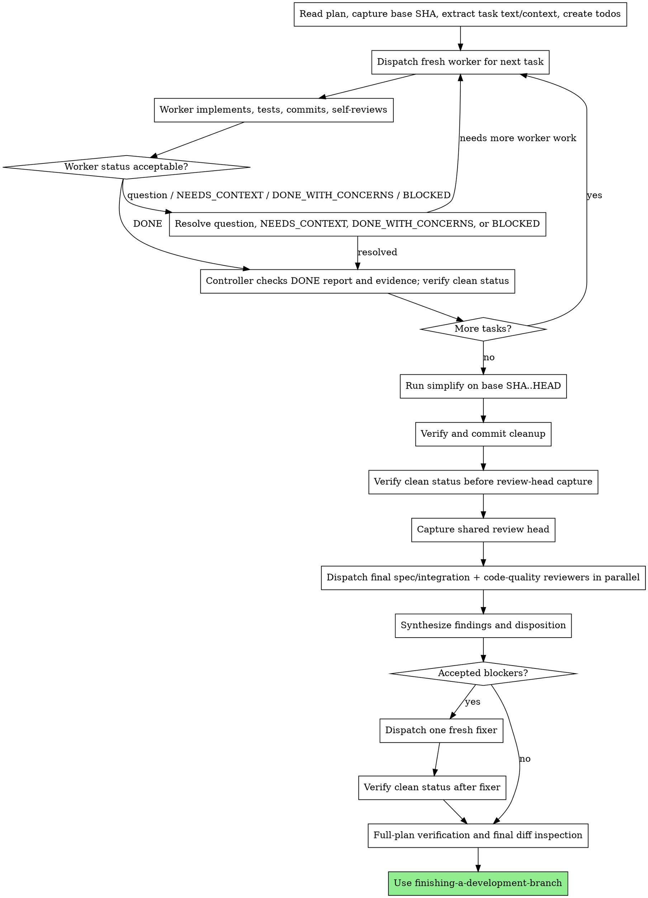

# Subagent-Driven Development

Execute an approved implementation plan with one fresh worker per task, writing
sequentially in the active worktree. After every task is complete, run
`simplify` across the plan range, commit any cleanup, then run one bounded
parallel review stage. That stage has separate final spec/integration and
code-quality reviewers.

**Core principle:** Fresh worker per task + one bounded post-plan parallel
review stage = focused implementation with independent final checks.

> **Prerequisite:** Read `writing-plans` and have an approved plan before using
> this workflow. The [`pi-subagents`](https://github.com/nicobailon/pi-subagents)
> extension must be installed. If `subagent({ action: "doctor" })` reports a
> healthy setup, read the `pi-subagents` skill if you need its full tool surface.

## When to Use

Use this when a plan has tasks that can be executed in sequence by isolated
workers. Extract every task and its needed context once, then keep the
controller focused on coordination and evidence.

## Agent Selection

| Role | Builtin agent | Timing and responsibility |
|---|---|---|
| Implementer | `worker` | Once per plan task, in plan order; implements, tests, self-reviews, and commits. |
| Simplify reviewers | `reviewer` | Once after all tasks; use its three review angles over the explicit plan range. |
| Final spec/integration reviewer | `reviewer` | Once in the formal parallel review stage; checks the complete plan and cross-task integration. |
| Code-quality reviewer | `reviewer` | Once in that same formal parallel stage; uses the `requesting-code-review` basis. |
| Fixer | `worker` | At most once, only when accepted blocking findings require changes. |

Use `context: "fresh"` for every worker and reviewer. Fresh reviewers are
read-only and adversarial. Do not use `oracle` as a reviewer: it is a
fork-context advisory agent, not an independent final reviewer.

Override the model only when the task warrants it. Mechanical work can use a
cheaper configured worker model; integration, debugging, or broad review can
use the default or a more capable configured model.

## Process



The fixer goes directly to verification. Do not automatically re-run either
reviewer. A further focused review requires an explicit, concrete risk decision
from the controller or human.

## Sequential Worker Loop

Capture `base_sha` before the first task. For each task, fill the complete task
text and scene-setting context into `./implementer-prompt.md`, then dispatch:

```typescript
subagent({
  agent: "worker",
  task: `<full content of ./implementer-prompt.md with task fields filled>`,
  context: "fresh"
})
```

Workers must self-review, run relevant verification, commit their task, and
report evidence. A `DONE` result advances only after the controller checks the
report, commit, changed files, verification evidence, and `git status --short`.
After every worker commit, unexpected staged, modified, or untracked files
block progression. Only explicitly recognized scratch files may be excluded.
Never have parallel workers write in the active worktree.

Handle worker statuses deliberately:

- **Questions:** answer clearly, add the answer to the context, and dispatch a
  fresh worker with the augmented prompt.
- **NEEDS_CONTEXT:** supply the missing facts, paths, decisions, or constraints,
  then dispatch a fresh worker with the complete augmented prompt.
- **DONE_WITH_CONCERNS:** inspect the concerns. Resolve correctness or scope
  concerns before advancing; record non-blocking observations with the task.
  Advance only after it is effectively `DONE` with sufficient evidence.
- **BLOCKED:** determine whether context, an approved decision, model capability,
  task decomposition, or the plan is at fault. Supply context or use a more
  capable worker where appropriate. Escalate an unclear product or plan decision
  rather than guessing.

The normal writer path is strictly sequential. For a genuinely isolated set of
writes, a clean worktree and `worktree: true` can isolate parallel workers, but
this is rare and requires an explicit merge plan. Never combine parallel writes
in the active worktree.

Long worker runs may be asynchronous when polling improves control:

```typescript
subagent({ agent: "worker", task: "<implementer prompt>", context: "fresh", async: true })
subagent({ action: "status", id: "<run-id>" })
```

Watch `needs_attention` signals. Check `subagent({ action: "status" })` before
interrupting a quiet run; silence during tools or tests is normal. If genuinely
stuck, use `subagent({ action: "interrupt", id: "<run-id>" })` and re-dispatch
with materially clearer instructions.

## Simplify and Formal Parallel Review

After all worker tasks are complete, run `git status --short` before
`simplify`; unexpected staged, modified, or untracked files block progression,
and only explicitly recognized scratch files may be excluded. Run `simplify`
once on the explicit `base_sha..HEAD` plan range. Apply its appropriate cleanup,
run verification, and make one cleanup commit if it changed files. Before
capturing `review_head`, run `git status --short` again and apply the same
cleanliness rule. Capture `review_head` only after that cleanup commit (or after
confirming no cleanup was needed).

Read the adjacent source templates `./final-reviewer-prompt.md` and
`./code-quality-reviewer-prompt.md`. In each file, substitute the placeholders
in the task body below the `---` delimiter, then pass only that filled task body
to the reviewer. Both tasks receive the same inputs: plan path, `base_sha`,
`review_head`, branch and implementation summaries, verification commands, and
recorded verification results.

Create an OS temporary directory only for the two output artifacts:

```bash
tmp_dir=${TMPDIR:-/tmp}
review_dir=$(mktemp -d "${tmp_dir%/}/final-review-XXXXXX")
echo "$review_dir"
```

Substitute the returned path for `<review-dir>`:

```typescript
subagent({
  tasks: [
    { agent: "reviewer", task: "<filled task body from ./final-reviewer-prompt.md>", output: "<review-dir>/final-review.md" },
    { agent: "reviewer", task: "<filled task body from ./code-quality-reviewer-prompt.md>", output: "<review-dir>/code-quality-review.md" }
  ],
  context: "fresh",
  concurrency: 2
})
```

Both reviewers are read-only; their configured output artifacts record the
returned findings. The final spec/integration prompt checks every plan
requirement, omissions, regressions, and interactions across tasks. The quality
prompt follows `requesting-code-review` and checks maintainability, correctness
risks, tests, and project conventions. Do not call these reviewers sequentially,
fork their context, or start formal review before `simplify`.

## Finding Disposition and Fixes

Synthesize the two reports into one disposition. Critical and Important
findings block completion. Reject duplicate, false-positive, out-of-scope, and
plan-contradicted findings with a recorded reason. Minor findings are deferred
when no fixer is needed.

When accepted blockers remain, dispatch one fixer: a **single** fresh worker
with all accepted blockers plus only Minor items that are cheap, safe, and in
scope. Its filled task must include:

```text
Plan: <absolute plan path>
Review range: <base_sha>..<review_head>
Final review report: <path or full content>
Code-quality report: <path or full content>
Accepted findings: <deduplicated list to fix>
Rejected findings: <list with reasons; do not implement>
Constraints: preserve approved scope; do not make product or architecture
  decisions; ask the controller if a finding requires one.
Verification: <complete plan verification commands>
Report: status, summary, verification commands and results, changed files,
  commit SHA, self-review findings, and remaining concerns.
```

Dispatch it with `agent: "worker"` and `context: "fresh"`. It fixes only the
accepted set, runs complete plan verification, self-reviews, and commits once.
After the fixer commit, run `git status --short`; unexpected staged, modified,
or untracked files block progression, and only explicitly recognized scratch
files may be excluded. Do not dispatch a second fixer as an automatic loop.

After both review reports have been read and dispositioned, remove the output
directory with `rm -rf "$review_dir"`; also clean it up before stopping after a
failed or interrupted review call.

After a fixer, or after finding synthesis when no fix is needed, run full-plan
verification and inspect the final `base_sha..HEAD` diff. This is the terminal
`verification-before-completion` gate. Only then use
`finishing-a-development-branch`.

## Prompt Templates

The controller uses these adjacent source templates. It fills the placeholders
in each task body below `---` before dispatch; reviewer output artifacts are
separate OS-temporary files.

- `./implementer-prompt.md` - content for each `worker` task
- `./final-reviewer-prompt.md` - final spec/integration reviewer task source
- `./code-quality-reviewer-prompt.md` - quality reviewer task source based on `requesting-code-review`

## Example Workflow

```text
[Read approved plan; capture base_sha; extract Tasks 1 and 2; create todos]

Task 1:
  subagent({ agent: "worker", task: "<implementer-prompt Task 1>", context: "fresh" })
  Worker reports DONE with commit and passing tests.
  Controller checks evidence and marks Task 1 complete.

Task 2:
  subagent({ agent: "worker", task: "<implementer-prompt Task 2>", context: "fresh" })
  Worker reports DONE_WITH_CONCERNS; controller resolves a scope concern,
  checks the resulting evidence, and marks Task 2 complete.

[No intermediate reviewers were dispatched.]
[Run simplify on base_sha..HEAD; verify cleanup; commit cleanup.]
[Capture review_head. Fill only the task bodies below `---` in the adjacent templates with shared plan/base/head/summary/verification inputs.]
[Create review_dir with the mktemp snippet above.]
subagent({
  tasks: [
    { agent: "reviewer", task: "<filled final reviewer task body>", output: "<review-dir>/final-review.md" },
    { agent: "reviewer", task: "<filled code-quality reviewer task body>", output: "<review-dir>/code-quality-review.md" }
  ],
  context: "fresh",
  concurrency: 2
})
[Synthesize and disposition both reports, then remove review_dir.]
[If accepted blockers exist, one fresh fixer handles the accepted set, verifies the full plan, and commits once.]
[Run final full-plan verification and inspect base_sha..HEAD.]
[Use finishing-a-development-branch.]
```

## Red Flags

**Never:**
- Dispatch a reviewer after each task or treat task completion as reviewer-gated
- Call final reviewers sequentially instead of one parallel stage
- Automatically re-review after a fixer or repeat review cycles without an explicit risk decision
- Start formal review before ranged `simplify` and its cleanup verification
- Capture the review head before the cleanup commit is complete
- Permit parallel writes in the active worktree
- Use `context: "fork"` for reviewers
- Use `oracle` as a reviewer
- Make a worker read the plan file instead of pasting the relevant task text
- Ignore questions, NEEDS_CONTEXT, DONE_WITH_CONCERNS, or BLOCKED
- Skip the final verification and diff inspection gate

## Integration

- **writing-plans** supplies the approved plan and is required before dispatch.
- **requesting-code-review** supplies the basis for the code-quality reviewer
  prompt.
- **simplify** runs once before formal review, explicitly over `base_sha..HEAD`.
- **verification-before-completion** is the terminal gate after synthesis and
  any fixer work.
- **finishing-a-development-branch** starts only after review, accepted fixes,
  full-plan verification, and final diff inspection are complete.
- **test-driven-development** guides worker implementation, and
  **pi-subagents** documents dispatch controls.
